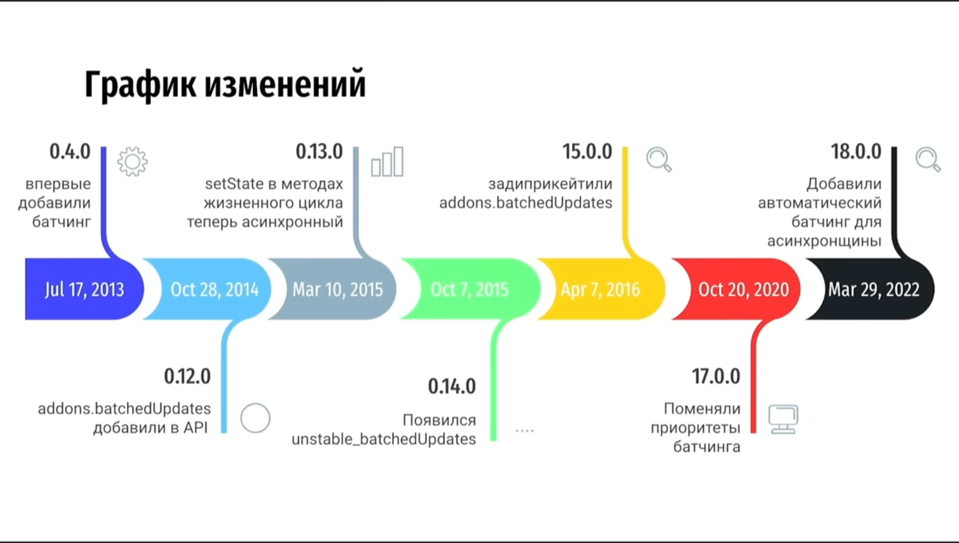

# React Batching от создания (v0.4.0) до React 18

- [Автор доклада](https://github.com/DmitriyGrosh)
- [Ссылка на видео](https://www.youtube.com/watch?v=lj0JjbVJPz0)

## Определение

Батчингом в React'е называют процесс группировки нескольких вызовов обновления состояния в один этап рендера.
Другими словами, пакетная обработка.

## Отличия React v17 от React v18 в батчинге

В React 18 был реализован автоматический батчинг.

Как это группируется?

В v17.0.2 синхронная часть - группировалась, несинхронная - нет. До React 18 батчинг также существовал, 
но автоматически работал только для обработчиков DOM событий.
В v18.0.2 - просто группируется по кускам по очереди. (т.е асинхронная часть тоже)

## React.createRoot()

Начиная с 18 версии, если рендерить через `createRoot()` - именно эта функция меняет поведение батчинга.

## unstable_batchedUpdates()

Как раз таки данная функция предоставляет группировку setState'ов для уменьшения рендеров.

> Обычно батчинг безопасен и не вызывает проблем при разработке, но если сразу после обновления 
> состояния нужно прочитать изменения в DOM, то можно использовать `ReactDOM.flushSync()` для отмены батчинга:
> `ReactDOM.flushSync()` может принудительно заставить компонент перерисовываться при каждом вызове `useState`

## История батчинга

