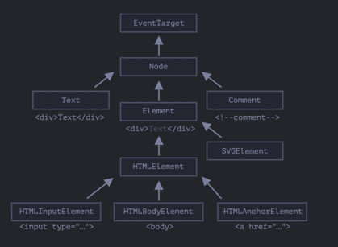

# Свойства узлов: тип, тег и содержимое

Корнем иерархии является `EventTarget`, от него наследует `Node` и остальные `DOM`-узлы.

`EventTarget` и `Node` - это абстрактные классы.

## Иерархия наследования



- `Object` - предоставляет методы обычного объекта
- `EventTarget` - благодаря ему все `DOM`-узлы поддерживают события.
- `Node` - благодаря ему появляется базовая функциональность, типа `parentNode`, `nextSibling`,
  `childNodes`.
- `Element` - базовый класс `DOM`-элементов.
- `HTMLElement` - предоставляет общие для HTML-элементов методы (и геттеры/сеттеры)

- Узнать имя класса 
  - `document.body.constructor.name // HTMLBodyElement`
  - `String(document.body) [object HTMLBodyElement]` 
- Проверить наследование
  - `document.body instanceof HTMLBodyElement // true`

Короче говоря, DOM-узлы - это обычные JS объекты.

## Свойство "nodeType"

Свойство nodeType предоставляет ещё один, «старомодный» способ узнать «тип» DOM-узла.

Его значением является цифра:

- `elem.nodeType == 1` для узлов-элементов,
- `elem.nodeType == 3` для текстовых узлов,
- `elem.nodeType == 9` для объектов документа,

## Тег: nodeName и tagName

Позволяет узнать имя тега (или ноды). Если работаем только с элементами - разницы не будет между ними,
но если, например, с комментариями, то tagName будет `undefined`, так как комментарий не наследуются от `Element`.

```js
alert( document.body.nodeName ); // BODY
alert( document.body.tagName ); // BODY
```

## innerHTML

Позволяет получить HTML-содержимое элемента в виде строки.

`innerHTML+=` осуществляет перезапись. Так как содержимое «обнуляется» и переписывается заново, все изображения и 
другие ресурсы будут перезагружены.

Есть еще интересные побочные эффекты, например, когда текст был выделен мышкой, то при перезаписи через
`innerHTML` выделение сбросится. А если это например `input`, то текст введеный внутри сбросится 
что логично, мы по сути перезаписали элемент)

## outerHTML

Свойство `outerHTML` содержит `HTML` элемента целиком. Это как `innerHTML` плюс сам элемент.

в отличие от `innerHTML`, запись в `outerHTML` не изменяет элемент. 
Вместо этого элемент заменяется целиком во внешнем контексте.

## nodeValue/data: содержимое текстового узла

Прочитаем содержимое текстового узла и комментария:

```html
<body>
  Привет
  <!-- Комментарий -->
  <script>
    let text = document.body.firstChild;
    alert(text.data); // Привет

    let comment = text.nextSibling;
    alert(comment.data); // Комментарий
  </script>
</body>
```

## textContent: просто текст

Свойство textContent предоставляет доступ к тексту внутри элемента за вычетом всех <тегов>.

```html
<div id="news">
  <h1>Срочно в номер!</h1>
  <p>Марсиане атаковали человечество!</p>
</div>

<script>
  // Срочно в номер! Марсиане атаковали человечество!
  alert(news.textContent);
</script>
```

Стоит присваивать текст именно через это свойство, чтобы экранировать "опасные" символы.

## Свойство "hidden"

Атрибут и DOM-свойство «hidden» указывает на то, видим ли мы элемент или нет.

Технически, `hidden` работает так же, как `style="display:none"`. Но его применение проще.